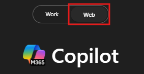

---
demo:
  title: 'Demostración: ventas'
---

[Volver al índice](https://microsoftlearning.github.io/MS-4021-Copilot-Immersion-Experience/)

# Demostración: ventas

**Escenario**:  

Estás en ventas para una empresa de carga de vehículos eléctricos y estás desarrollando un plan estratégico para el próximo año.

## Configuración de la demostración

Los documentos de ejemplo se encuentran en el repositorio de GitHub MS-4021 [aquí](https://github.com/MicrosoftLearning/MS-4021-Copilot-Immersion-Experience/tree/master/ResourceFiles).

Estos son los archivos específicos necesarios para esta demostración:

- [Charger_sales_report_2022-2024.xlsx](https://github.com/MicrosoftLearning/MS-4021-Copilot-Immersion-Experience/raw/master/ResourceFiles/Charger_sales_report_2022-2024.xlsx)

> **NOTA:** estos archivos pueden tardar hasta 10 minutos en sincronizarse con OneDrive después de su descarga. Para evitar retrasos durante la demostración, asegúrate con antelación de que estos archivos estén descargados y disponibles en OneDrive. Si los archivos no están disponibles, abre los documentos y copia los vínculos del archivo compartido para usarlos en la demostración.

## Demostraciones

### Copilot Chat

1. Abre un explorador y ve a [M365copilot.com](https://m365copilot.com/).

1. Asegúrate de que el Modo web está seleccionado.

    

1. Empecemos pidiendo a Copilot que investigue una métrica clave. En el campo de indicaciones de **Copilot Chat**, escribe:

    ```text
    What is the ratio of EV cars to EV chargers by region in the US for the past 3 years? Please show it in a table organized by region.
    ```

    

1. Ahora compararemos las tendencias nacionales con el rendimiento de las ventas de tu empresa. Cargarás el conjunto de datos proporcionado y le pedirás a Copilot que visualice los datos:

    En el campo de indicaciones, escribe:

    ```text
    I need to know the quarterly trends for each of our sales regions. Create a quarterly revenue line graph for the past 2 years based on:
    ```

    > **NOTA:** no envíes la indicación todavía. Ve al paso siguiente para cargar el archivo.

1. Selecciona **Agregar contenido** y carga [**Charger_sales_report_2022-2024.xlsx**](https://github.com/MicrosoftLearning/MS-4021-Copilot-Immersion-Experience/raw/master/Resourcefiles/Charger_sales_report_2022-2024.xlsx). Envía la indicación.

    

1. Ve un paso más allá y pide a Copilot recomendaciones que exportará a un documento de Word:

    En el campo de indicaciones, escribe:

    ```text
    Based on the trend, suggest two ways I can increase EV charger sales in the Mountain and Midwest regions. Export the recommendations to a Word Document.
    ```

1. Selecciona el hipervínculo que proporciona Copilot para el nuevo documento de Word para abrirlo.

1. Una vez abierto, selecciona **Habilitar edición** y, a continuación, activa "Autoguardado". Selecciona la cuenta de OneDrive cuando se te solicite.

### Copilot en Word

Ahora pediremos a Copilot que amplíe estas estrategias y redacte propuestas sobre cómo implementarlas.

1. El documento de Word generado de la demostración anterior ya debería estar abierto, si no es así, ábrelo ahora (ya sea en el explorador o en la aplicación de escritorio).

1. Selecciona en cualquier parte del cuerpo del documento y selecciona el icono Copilot.

    Escribe la siguiente indicación:

    ```text
    Draft a detailed proposal on how we could implement each of the strategies outlined in this document. Ensure the plan is actionable and includes resource requirements, timelines, and key stakeholders.
    ```

1. Selecciona **Mantener** o, si el tiempo lo permite, muestra cómo retocar el documento mediante Copilot.

1. Una vez finalizado, guarda el documento como **EV Sales Proposal.docx** y copia la dirección URL compartida que se usará en el paso siguiente (habilita Autoguardado y selecciona tu cuenta de OneDrive).

    

    > **Sugerencia para el instructor:** usa este paso para demostrar cómo Copilot se basa en salidas anteriores, mejorando las ideas en una propuesta coherente.

### Copilot en PowerPoint

1. Inicia Microsoft PowerPoint desde el explorador [PowerPoint.new](https://PowerPoint.new) o usa la aplicación de escritorio.

1. Abre una nueva presentación en blanco.

1. En el panel de Copilot, selecciona la indicación "Crear presentación a partir de archivo".

1. Pegue el vínculo **EV Sales Proposal.docx** después de "Crear una presentación desde" y selecciona **Enviar**.

    La indicación completa debe ser como la siguiente:

    ```text
    Create a presentation from [Link to EV Sales Proposal.docx].
    ```

1. Copilot comienza a generar diapositivas basadas en la propuesta de ventas de vehículos eléctricos, proporcionando un esquema junto con características como notas para el ponente, imágenes, diseños de diapositivas y una etiqueta de confidencialidad general.

    > **NOTA:** la generación de diapositivas puede tardar hasta dos minutos, según la complejidad del documento y el número de diapositivas.

[Volver al índice](https://microsoftlearning.github.io/MS-4021-Copilot-Immersion-Experience/)
