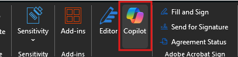

---
demo:
  title: 'Demostración: asistente ejecutivo'
---

[Volver al índice](https://microsoftlearning.github.io/MS-4021-Copilot-Immersion-Experience/)

# Demostración: asistente ejecutivo

**Escenario**:

Se te ha encargado que resumas la transcripción de la llamada de conferencia sobre los resultados más reciente para tu ejecutivo. Esta tarea incluye la extracción de información clave, la creación de un resumen ejecutivo y la preparación de una reunión de seguimiento.

## Configuración de demostración

Los documentos de ejemplo se encuentran en el repositorio de GitHub MS-4021 [aquí](https://github.com/MicrosoftLearning/MS-4021-Copilot-Immersion-Experience/tree/master/ResourceFiles).

Estos son los archivos específicos necesarios para esta demostración:

- [Microsoft_FY24_Second_Quarter_Earnings_Conference_Call_Transcript.docx](https://github.com/MicrosoftLearning/MS-4021-Copilot-Immersion-Experience/raw/master/ResourceFiles/Microsoft_FY24_Second_Quarter_Earnings_Conference_Call_Transcript.docx)

> **NOTA:** estos archivos pueden tardar hasta 10 minutos en sincronizarse con OneDrive después de su descarga. Para evitar retrasos durante la demostración, asegúrate con antelación de que estos archivos estén descargados y disponibles en OneDrive. Si los archivos no están disponibles, abre los documentos y copia los vínculos del archivo compartido para usarlos en la demostración.

## Pasos de la demostración

### Copilot en Word

Comenzaremos revisando la transcripción de la llamada sobre resultados más reciente y resumiendo los puntos clave para tu ejecutivo.

1. Selecciona y abre el archivo **Microsoft_FY24_Second_Quarter_Earnings_Conference_Call_Transcript.docx** en Word (ya sea en el explorador o en la aplicación de escritorio).

    > **NOTA:** puede que desees desplazarte rápidamente por el documento para mostrar el tamaño que tiene y que no es una tarea sencilla para resumirlo.

1. En la cinta de opciones, selecciona el icono Copilot:

    

1. El panel Copilot se deberá abrir. Escriba la siguiente indicación donde dice **+ ¿Qué quiere que Copilot escriba?**:

    ```text
    Summarize the key points from the Microsoft FY24 Second Quarter Earnings Conference Call.
    ```

1. Imagina que tu ejecutivo quiere saber sobre qué habló específicamente Satya Nadella durante la llamada. Usa la siguiente indicación:

    ```text
    Provide a brief summary of Satya Nadella's remarks during the earnings call.
    ```

   - Muestra cómo Copilot incluye referencias para cada punto de viñeta, lo que permite la navegación rápida a secciones específicas.  
   - Haz clic en una referencia para mostrar cómo Copilot recupera al instante el contenido pertinente en el documento.

1. Para crear un informe detallado, pregunta a Copilot:

    ```text
    Analyze the Microsoft FY24 Second Quarter Earnings Conference Call document to provide a comprehensive report that includes:
    - A summary of the key points from each speaker
    - Identification of the top three growth areas and their contributing factors.
    - A detailed breakdown of the financial performance, including revenue, operating income, and earnings per share.
    - Trends in AI adoption and its influence on Microsoft's business strategy.
    - A comparison of this quarter's performance with the same quarter last year, highlighting significant changes.
    - Key strategic initiatives and future outlook as discussed in the call.
    ```

    > **Sugerencia:** Menciona que se trata de una indicación compleja y Copilot puede tardar algún tiempo en generar la respuesta.

1. Una vez que Copilot complete el análisis, selecciona el icono **Copiar** para guardar los resultados para el paso siguiente.

    

### Copilot Chat

El informe proporcionado por Word es un excelente punto de partida, pero ahora queremos usar Copilot Chat para ayudarnos a crear un resumen ejecutivo.

1. Abre un explorador y ve a [M365copilot.com](https://m365copilot.com/).

1. Asegúrate de que el **Modo web** está seleccionado.

    

1. Pega la respuesta de Copilot en Word en Copilot Chat con la siguiente indicación:

    ```text
    Based on the following information, provide an executive summary on the following information:

    [paste the Word output here]
    ```

    > **Nota:** limpia el texto superfluo del contenido copiado para garantizar la claridad.

1. Mejora el resumen en un formato conciso:

    ```text
    Summarize this executive summary into a more concise format by focusing on the most critical insights and metrics for each speaker. Use a structured format with headings and bullet points to improve readability. Export to a Word document.
    ```

   - Si Copilot no exporta el documento, vuelve a modificar la solicitud: "Guarda este resumen como un documento de Word".

1. Con el resumen ejecutivo completo, pregunta a Copilot:

    ```text
    Based on the summarized executive summary, generate 5-7 concise and impactful talking points my manager can use in their next leadership call. Focus on key achievements, growth areas, and strategic priorities.
    ```

### Copilot en Outlook

En esta demostración, usaremos Copilot en Outlook para configurar una reunión con el ejecutivo para informarle de todo lo que sucedió durante la llamada de conferencia sobre resultados del segundo trimestre.

1. Abre un explorador y ve a [outlook.office.com](https://outlook.office.com.com/).

1. Para abrir el panel de Copilot, selecciona el icono Copilot en la cinta de Outlook.

1. Usa la siguiente indicación para programar una sincronización:

    ```text
    I need to schedule a 30-minute meeting with [/Pick a colleague] tomorrow afternoon to discuss the Second Quarter Earnings Conference Call. Can you suggest a time that works? If they are unavailable, provide an alternative.
    ```

1. Copilot deberá sugerir una hora y una fecha para la reunión. La indicación muestra un elemento de calendario que se puede enviar o editar. Selecciona **Editar**.

1. Cambia al asistente de programación para mostrar que la hora sugerida por Copilot le va bien al jefe de proyecto. Ambos deberíais estar disponibles.

1. Vuelve a la pestaña de eventos y selecciona **Borrador con Copilot** en el cuerpo del evento.

1. En Windows, escribe lo siguiente la ventana de solicitudes:

    ```text
    I’m meeting with my boss to discuss key updates and strategic initiatives they missed from the Second Quarter Earnings Conference Call. Create an agenda to discuss financial performance, AI and technology integration, strategic acquisitions, productivity updates, and future outlook.
    ```

1. Opcionalmente, antes de seleccionar **Mantener**, puedes pedir a Copilot que la alargue, la acorte o cambie el tono de la agenda redactada.

[Volver al índice](https://microsoftlearning.github.io/MS-4021-Copilot-Immersion-Experience/)
