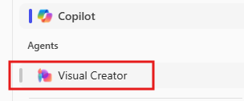

---
demo:
  title: 'Demostración: marketing'
---

[Volver al índice](https://microsoftlearning.github.io/MS-4021-Copilot-Immersion-Experience/)

# Demostración: marketing

**Escenario**:  

Estás en marketing para una empresa de bebidas, tu objetivo es analizar las tendencias de mercado, crear un análisis de marketing y desarrollar una nueva campaña de redes sociales.

## Configuración de la demostración

Los documentos de ejemplo se encuentran en el repositorio de GitHub MS-4021 [aquí](https://github.com/MicrosoftLearning/MS-4021-Copilot-Immersion-Experience/tree/master/ResourceFiles).

Estos son los archivos específicos necesarios para esta demostración:

- [Promotion_Plan_for_Chai_Tea_in_Latin_America.docx](https://github.com/MicrosoftLearning/MS-4021-Copilot-Immersion-Experience/raw/master/ResourceFiles/Promotion_Plan_for_Chai_Tea_in_Latin_America.docx)

- [Mystic_Spice_Premium_Chai_Tea_product_description.docx](https://github.com/MicrosoftLearning/MS-4021-Copilot-Immersion-Experience/raw/master/ResourceFiles/Mystic_Spice_Premium_Chai_Tea_product_description.docx)

- [Contoso_Chai_Tea_market_trends.docx](https://github.com/MicrosoftLearning/MS-4021-Copilot-Immersion-Experience/raw/master/ResourceFiles/Contoso_Chai_Tea_market_trends.docx)

- [Contoso_Chai_Tea_social_marketing_trends.xlsx](https://github.com/MicrosoftLearning/MS-4021-Copilot-Immersion-Experience/raw/master/ResourceFiles/Contoso_Chai_Tea_social_marketing_trends.xlsx)

> **NOTA:** estos archivos pueden tardar hasta 10 minutos en sincronizarse con OneDrive después de su descarga. Para evitar retrasos durante la demostración, asegúrate con antelación de que estos archivos estén descargados y disponibles en OneDrive. Si los archivos no están disponibles, abre los documentos y copia los vínculos del archivo compartido para usarlos en la demostración.

## Demostraciones

### Copilot en Word

Usa Copilot en Word para redactar un análisis de mercado detallado y pensar en ideas creativas para campañas de marketing adaptadas al mercado latinoamericano.

1. Abre Word (ya sea en el explorador o en la aplicación de escritorio).

1. En el cuadro de indicaciones **Describe lo que deseas escribir**, escribe lo siguiente:

    ```text
    Create a Market Analysis report for Mystic Spice Premium Chai Tea using the attached files. Include the product description, market trend analysis, and a promotion plan for Latin America.

    [Promotion_Plan_for_Chai_Tea_in_Latin_America.docx], [Mystic_Spice_Premium_Chai_Tea_product_description.docx], [Contoso_Chai_Tea_market_trends.docx]
    ```

    > **NOTA:** los corchetes indican que se hace referencia a un documento. Al hacer referencia a un documento, puedes pegar el vínculo compartido directamente o hacer referencia al nombre de archivo si está disponible en OneDrive.

1. Haz que Copilot cree una nueva sección para agregar ideas para campañas en redes sociales:

    Escribe la siguiente indicación:

    ```text
    Draft a new section for social media campaigns to promote Mystic Spice Premium Chai Tea. Include a brief description of 2-3 campaign ideas, each with a unique focus. For each campaign, provide a tagline that reflects its theme and resonates with our target audience of young professionals and tea enthusiasts.
    ```

1. Guarda este nuevo documento como **LATAM_Market_Analysis.docx**.

### Copilot Chat

Usa Copilot Chat para evaluar la eficacia de las campañas en redes sociales propuestas y mejora las estrategias para la relevancia cultural en el mercado latinoamericano.

1. Abre un explorador y ve a [M365copilot.com](https://m365copilot.com/).

1. Asegúrate de que el Modo web está seleccionado.

    

1. En Windows, escribe lo siguiente la ventana de solicitudes:

    ```text
    Review the social media campaigns outlined in the Market Analysis Report for Mystic Spice Premium Chai Tea.docx. Evaluate which campaign might resonate best with the LATAM market based on cultural relevance, target audience preferences, and alignment with regional trends. Provide reasons for your choice and suggest any adjustments to improve its impact.
    ```

    > **NOTA:** no envíes la indicación todavía. Ve al paso siguiente para cargar el archivo.

1. Selecciona **Agregar contenido** y carga el archivo **LATAM_Market_Analysis.docx** que guardaste en OneDrive en la demostración anterior. Envía la indicación.

    

1. Copilot deberá recomendarte una de las campañas para centrarte en y te proporcionará sugerencias para mejorarla. En la siguiente indicación, queremos que Copilot sugiera un eslogan para una campaña de marketing para esta nueva idea:

    ```text
    Generate a catchy marketing slogan for the [Campaign name - e.g., 'Morning Motivation'] campaign that highlights its unique value proposition and resonates with the LATAM market. Ensure the slogan reflects a vibrant and culturally relevant tone that appeals to young professionals.
    ```

1. Opcionalmente, para la última indicación, puedes pedir a Copilot que genere un nuevo vídeo para la campaña:

    En Copilot Chat, en el lado derecho, selecciona **Agente de generador visual**:

    

    A continuación, escribe la siguiente indicación:

    ```text
    Create a captivating social media video for Mystic Spice Chai Tea that highlights its unique flavor and vibrant appeal. The video should feature eye-catching visuals, with colors, and themes that resonate with young professionals and tea enthusiasts.
    ```

### Copilot en Excel

1. Asegúrate de que has descargado [Contoso_Chai_Tea_market_trends_2023.xlsx](https://github.com/MicrosoftLearning/MS-4021-Copilot-Immersion-Experience/raw/master/Contoso_Chai_Tea_market_trends_2023.xlsx) y abre el documento en Excel (ya sea en la web o en la aplicación de escritorio).

1. Para abrir el panel de Copilot, selecciona **Copilot** en la cinta.

1. Escribe la siguiente indicación en Excel:

    ```text
    On average, how many sales do we get per social media campaign view?
    ```

1. A continuación, pide a Copilot que compare las ventas con la interacción en redes sociales:

    ```text
    Can you show a correlation between social media engagement and sales?
    ```

1. Luego, escribe la siguiente indicación:

    ```text
    How many social media campaign views did we have from September to December?
    ```

[Volver al índice](https://microsoftlearning.github.io/MS-4021-Copilot-Immersion-Experience/)
