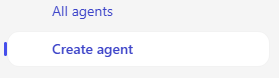

---
task:
  title: 'Experiencia de inmersión: Agentes (ejecutivos)'
---

## Experiencia de inmersión: Agentes (ejecutivos)

Explore cómo Microsoft 365 Copilot y Copilot Studio pueden ayudarle a abordar un desafío real relacionado con el trabajo mediante el diseño de un **agente simple basado en recuperación**. Este ejercicio se le guiará por la identificación de un problema, su desglose, a explorar dónde puede ayudar la inteligencia artificial y, después, crear un agente conceptual para resolverlo.  

Realizará cuatro tareas:

- Identificar un problema relacionado con el trabajo  
- Desglosar el problema y explorar dónde podría ayudar la inteligencia artificial  
- Usar **investigador** para descubrir información e ideas de soluciones  
- Conceptualizar y simular un agente basado en recuperación en **Copilot Studio**  

> **NOTA:** Se proporcionan mensajes de ejemplo para ayudarle a empezar: no dude en personalizarlos para adaptarlos a su situación. 
>
> Si quiere ayudar a generar o refinar mensajes, pruebe el <a href="https://appsource.microsoft.com/en-us/product/office/WA200007578" target="_blank">agente Entrenador de indicaciones</a>,<br>que puede sugerir, mejorar y evaluar mensajes para que obtenga mejores resultados con Copilot.

### Tarea 1: Identificar un desafío relacionado con el trabajo  

Para empezar, piense en un problema real que encuentre en su rol, algo que ralentice o dificulte el acceso a la información. Puede reflexionar individualmente o usar **Copilot Chat** como asociado para ayudar a generar ideas e identificar un desafío en el que recuperar y organizar los conocimientos marcaría la diferencia.  

Para guiar su pensamiento, tenga en cuenta lo siguiente:  

- **Qué funciona bien en la actualidad**  
- **Qué no funciona bien**  
- **Dónde *podría ayudar* la inteligencia artificial**  

**Pasos**:  

- Abra una nueva pestaña del explorador y vaya a [m365.cloud.microsoft/chat](https://m365.cloud.microsoft/chat).  
- Asegúrese de que la pestaña **Modo Trabajo** está seleccionada en **Copilot Chat**:  

     

    **Mensaje de muestra:**

   ```text
   I’m researching common day-to-day issues I face at work, such as processes, collaboration, or time management. Look at recent conversations from [Teams chats, Outlook emails, or other collaboration tools] related to [your role focus]. Summarize the key issues or pain points mentioned in the last 6 months. Show the results in a table with:  

    - Title: Short label for the issue  
    - Description: Brief summary of the challenge  
    - Frequency: How often it comes up (e.g., number of mentions)
   ```

### Tarea 2: Desglosar el problema

Con **Copilot Chat**, tome el desafío que ha identificado en la Tarea 1 y divídalo en partes más pequeñas:

- ¿Qué hace que este problema sea difícil?  
- ¿Dónde se bloquea o se pierde la información?  
- ¿A quién afecta más?  

    **Mensaje de ejemplo (Copilot Chat: Modo de trabajo):**

    ```text
    Break down the problem of [insert challenge]. Identify root causes, pain points, and which areas of work are most affected.
    ```

    > **SUGERENCIA:** Piense en dónde la recuperación de conocimientos le ahorraría tiempo o ayudaría al equipo a tomar decisiones más rápidas.

### Tarea 3: Exploración de ideas de soluciones de IA con Investigador

Use el **Agente Investigador** para ver cómo podrían ayudar Copilot y los agentes. Céntrese en las soluciones que recuperan, organizan o resumen el conocimiento, no en las que automatizan las tareas. 

**Pasos**:

- Abra una nueva pestaña del explorador y vaya a [m365.cloud.microsoft/chat](https://m365.cloud.microsoft/chat).
- En el menú Copilot Chat expanda **Agentes** y seleccione **Investigador**  

      

    **Mensaje de ejemplo (Agente Investigador):**

    ```text
    Explore possible AI solutions to address [insert problem]. Focus on retrieval-based approaches using Microsoft Copilot, Copilot Studio agents, or connected knowledge sources. Summarize three possible solution approaches, their benefits, and limitations.
    ```

    > **SUGERENCIA:** Busque oportunidades en las que un agente podría facilitar la búsqueda, reutilización o uso compartido de los conocimientos.

    > **NOTA:** Investigador puede tardar entre 5 y 10 minutos en completarse, en función de la solicitud. Sus respuestas son muy detalladas, por lo que mientras funciona, intente ejecutar el mismo mensaje en Copilot Chat. La comparación de las dos salidas es una excelente manera de ver cómo aborda la tarea cada herramienta.

### Tarea 4: Conceptualizar el agente

Ahora, tome las conclusiones y cree un agente ficticio sencillo en **Copilot Studio**. Mantenga la atención en la recuperación: el agente debe ayudar a exponer, organizar o resumir información.

**Pasos**:

- **Inicio en Copilot Studio**

    1. Abra el explorador y vaya a [m365.cloud.microsoft/chat](https://m365.cloud.microsoft/chat).
    1. Seleccione **Crear agente** en el raíl de la derecha para iniciar **Copilot Studio**.

        

- **Definir el agente (pestaña Describir o Configurar)**

    1. Elija la pestaña **Describir** y use este mensaje de ejemplo (o escriba uno propio):

        ```text
        You’re a virtual assistant for our [project/team name]. Your role is to help with [key tasks]. Be concise, stay on-brand, and reference our shared resources when possible.
        ```

        

        > **NOTA:** Puede empezar desde cero o basar el agente en una plantilla, que rellena previamente valores e instrucciones que puede personalizar más adelante.

    1. Si **Describir** no está disponible, cambie a la pestaña **Configurar** y escriba los mismos detalles manualmente: nombre, descripción e instrucciones del agente.

        

- **Personalización del agente**

    En la pestaña **Configurar**, explore estas opciones:

    1. Agregue al menos una fuente de conocimiento (por ejemplo, un documento guardado en OneDrive o SharePoint, o sus correos electrónicos).

        

    1. Definición de mensajes de inicio para ayudar a otros usuarios a empezar a trabajar con el agente

        

        > **SUGERENCIA:** Los mensajes de inicio ayudan a guiar a los usuarios sobre cómo interactuar con el agente.

- **Probar y Crear**

    1. Use la característica **Probar** (disponible en el panel derecho en todo el proceso de creación del agente) para probar el agente de borrador y refinar los problemas.
    2. Cuando le convenzan los resultados, seleccione **Crear** para publicar el agente.
    3. Comparta el agente con otros usuarios o ábralo para su uso inmediato.  

> **SUGERENCIA:** El objetivo no es crear un agente perfecto hoy en día: es explorar cómo los agentes centrados en la recuperación pueden facilitar el acceso a los conocimientos en el trabajo diario.
