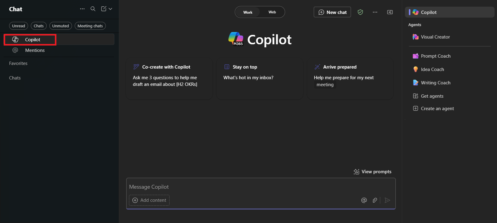

---
task:
  title: 'Experiencia de inmersión: ventas'
---

## Experiencia de inmersión: ventas

Recopila información de las interacciones recientes de los clientes, alinea con las acciones clave y prepárate para una próxima reunión con un cliente.

Realizarás tres tareas:

- Recopilarás información con **Microsoft 365 Copilot Chat**
- Alinearás las acciones con **Copilot en Outlook**
- Te prepararás para una reunión con un cliente con **Copilot en Word**

> **NOTA:** se proporcionan indicaciones de ejemplo para ayudarte a empezar. No dudes en personalizarlos para satisfacer tus necesidades, explora y sé creativo. Si Copilot no te proporciona el resultado deseado, mejora la indicación e inténtalo de nuevo. ¡Disfruta del proceso y diviértete experimentando!

### Tarea 1: Recopilación de información

Con **Microsoft 365 Copilot Chat** (en Teams), recopila y revisa la información de las interacciones recientes con un cliente sobre la implementación de un proyecto. Esta información te ayudará a comprender las preocupaciones, el progreso y las nuevas oportunidades que podrás abordar en las futuras interacciones.

**Pasos**:

- En **Microsoft Teams**, selecciona **Copilot** en la parte superior del panel **Chat**.  Se abrirá una ventana de **Copilot**.

    

- Asegúrate de que la pestaña "Modo trabajo" está seleccionada en Copilot Chat:

    

**Indicación de ejemplo**:

```text
Summarize my recent interactions with [/Name of Person] regarding [specific customer / topic / project]. Organize the summary by key points or actions discussed, and include any follow-up items or outstanding questions that may require attention.
```

> **NOTA:** reemplaza [Nombre de persona] por la persona en la que te centrarás y [cliente o tema o proyecto específicos] por el tema pertinente. Usa el carácter **/** (barra diagonal) para hacer referencia a contactos internos para obtener acceso rápido a las interacciones recientes.

### Tarea 2: Alineación de acciones

Con **Copilot en Outlook**, redacta un correo electrónico de seguimiento basado en la información recopilada en Copilot Chat. Incluye acciones abiertas, aclara las responsabilidades y proporciona actualizaciones a un compañero o equipo para garantizar la alineación y la responsabilidad.

**Pasos**:

- En **Outlook**, selecciona **Nuevo correo electrónico** y, a continuación, en la cinta de opciones, selecciona **Copilot** > **Borrador con Copilot**

    

**Indicación de ejemplo**:

```text
Using the insights below, draft a follow-up email to [Name of Person] highlighting the key actions and next steps. Also, ask for a follow-up meeting to discuss further.

[Paste insights from Copilot Chat here]
```

### Tarea 3: Preparación de una reunión con el cliente

Con **Copilot en Word**, redacta los temas de conversación para una próxima reunión de actualización del estado con el cliente. Asegúrate de que los temas de conversación se centren en los resultados clave, abordan las prioridades del cliente y aclaran los pasos siguientes.

**Pasos**:

- Inicia Microsoft Word desde el explorador [word.new](https://word.new) o usa la aplicación de escritorio.
- Escribe tu indicación donde dice **"Describe lo que quieres escribir"**.

    

**Indicación de ejemplo**:

```text
Using the insights below, draft talking points for an upcoming status update meeting with [Customer Name]. Focus on any challenges and next steps.

[Paste insights from Copilot Chat here, or add your own insights]
```
